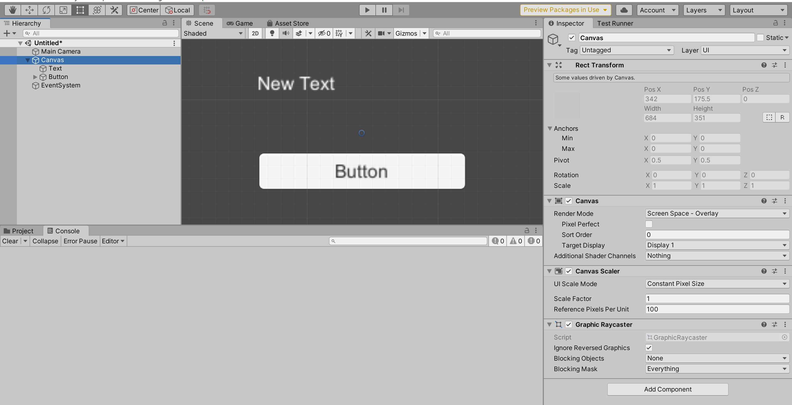
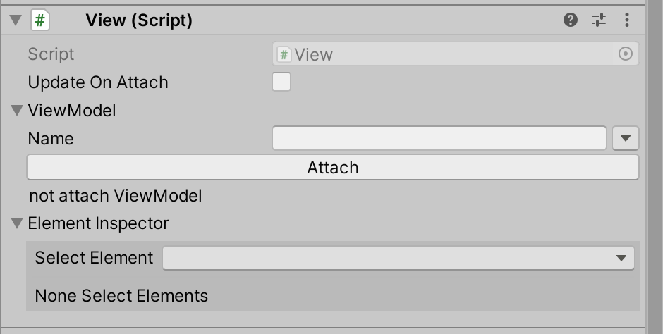
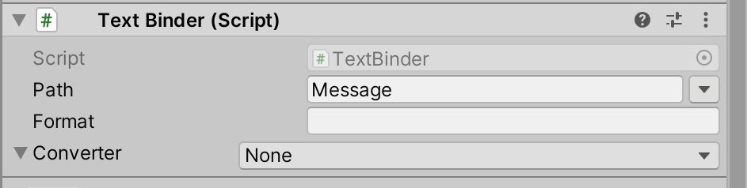
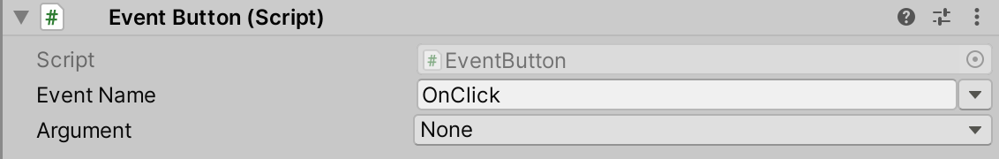
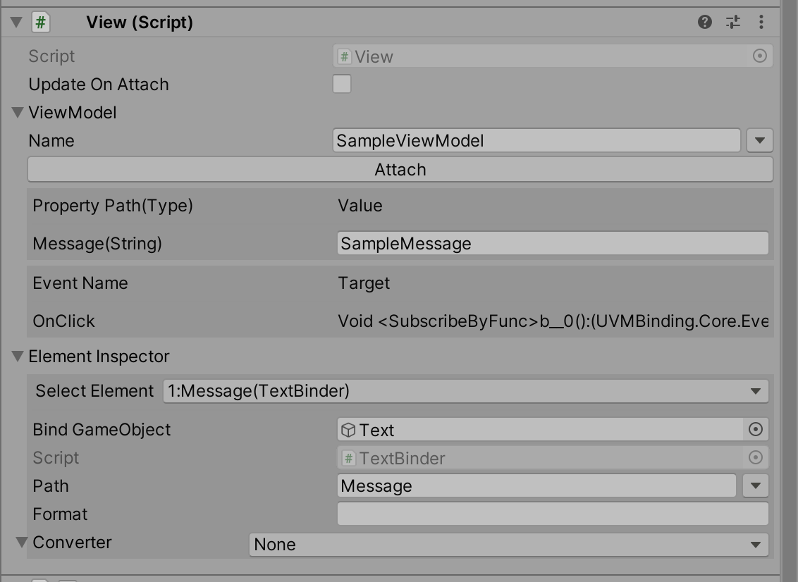

# UVMBinding (Unity ViewModel Binding)

Unity用のデータバインディングパッケージです。  
ViewModelを介してViewの更新を行います。  
この手のデータバインディングを行うパッケージはリフレクションを利用するケースが多いですがUVMBindingでは利用しません。  
また基本的な値の更新においてボックス化が発生しないようになっています。  

## インストール

upmで以下のURLでパッケージのインストールが出来ます。  
```
https://github.com/yazawa-ichio/UVMBinding.git?path=Unity/Assets/UVMBinding
```

## 簡単な使用例

詳しい利用方法はドキュメントにまとめる予定です。  

### ViewModelを作成する
データバインディング用のデータはViewModelクラスを継承して実装します。  

```cs
using UVMBinding;

public class SampleViewModel : ViewModel
{
	public string Message
	{
		get => GetImpl<string>("Message");
		set => GetImpl<string>("Message", value);
	}

	public event System.Action OnClick
	{
		add => Event.Subscribe("OnClick", value);
		remove => Event.Unsubscribe("OnClick", value);
	}
}
```

ILPostProcessorを利用してViewModelを簡易に記述する事が出来ます。  
基本的にはこちらの記述の方を推奨します。  
※MLAPI等で使われていますがUnityがまだ実験的な機能として提供しているものなのでUnityのバージョンアップ等で破壊的な変更が入る可能性があります。

```cs
using UVMBinding;

public class SampleViewModel : ViewModel
{
	[Bind]
	public string Message { get; set; } = "Default Message";
	[Event]
	public System.Action OnClick { get; set; }
}
```

### Viewを作成する

UVMBindingにおけるViewはGameObjectになります。  
View毎にスクリプトを書くことはありません。  
ViewModelから値を受け取り反映を行うBinderを組み合わせて作成します。  

1. TextとButtonを持つUIを作成


2. ViewのルートにViewのComponent追加


3. TextにTextBinderを追加しPathに`Message`を設定


4. ButtonにEventButtonを追加しNameに`OnClick`を設定


### ViewにViewModelをアタッチする
以下のようにAttach関数かViewModelプロパティにViewModelを設定すると表示が更新されます。  
以後はOnClickのイベントの用にViewModelの値を変更すれば表示に反映されます。

```cs
using UVMBinding;
using UnityEngine;

public class SampleViewModelTest : MonoBehaviour
{
	void Start()
	{
		GetComponent<View>().Attach<SampleViewModel>(vm => {
			vm.Message = "SampleMessage";
			vm.OnClick = () => vm.Message = "Clicked";
		});
	}
}
```

実行中にアタッチされているViewModelの情報などはViewComponentから確認できます。

